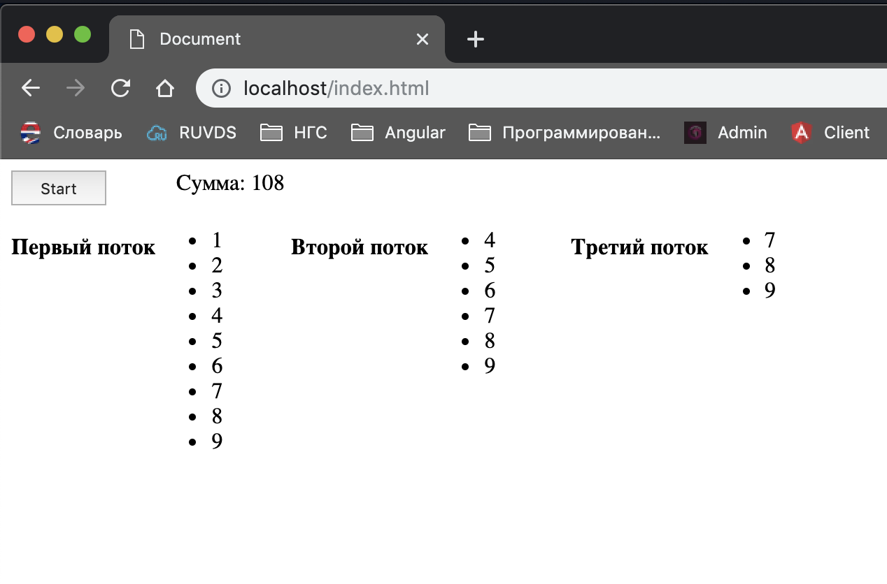

# Тест Angular

#### Результат залить на свой Guthub. Ссылку прислать на [форму обратной связи](https://forms.yandex.ru/u/5ce7aa786b6a50012c7424f4/).

## Задание 1.

1. Сгенерировать новый проект при помощи [Angular CLI](https://cli.angular.io). Тип стилей использовать SCSS.
2. Установить и подключить [Angular Material](https://material.angular.io)
3. Сгенерировать компонент app-tabe при помощи [Angular CLI](https://cli.angular.io)
4. В компоненте app-tabe при помощи компонента Table (mat-table) сделать одну таблицу одновременно

и с фильтром:


и с сортировкой:


Данные для таблицы:
```ts
export interface PeriodicElement {
  name: string;
  position: number;
  weight: number;
  symbol: string;
}

const ELEMENT_DATA: PeriodicElement[] = [
  {position: 1, name: 'Hydrogen', weight: 1.0079, symbol: 'H'},
  {position: 2, name: 'Helium', weight: 4.0026, symbol: 'He'},
  {position: 3, name: 'Lithium', weight: 6.941, symbol: 'Li'},
  {position: 4, name: 'Beryllium', weight: 9.0122, symbol: 'Be'},
  {position: 5, name: 'Boron', weight: 10.811, symbol: 'B'},
  {position: 6, name: 'Carbon', weight: 12.0107, symbol: 'C'},
  {position: 7, name: 'Nitrogen', weight: 14.0067, symbol: 'N'},
  {position: 8, name: 'Oxygen', weight: 15.9994, symbol: 'O'},
  {position: 9, name: 'Fluorine', weight: 18.9984, symbol: 'F'},
  {position: 10, name: 'Neon', weight: 20.1797, symbol: 'Ne'},
];
```


## Задание 2.
 
 1. Сгенерировать компонент app-start-page при помощи [Angular CLI](https://cli.angular.io)
 2. В компоненте app-start-page при помощи компонента Button (mat-button) сделать кнопку "Показать таблицу"
 3. При клике по этой кнопки должен появлятся компонент app-tabe поверх страницы в модальном окне. Для этого обязательно использовать CDK Overlay из [Angular Material](https://material.angular.io)
   > Визуально долно выглядеть **примерно** так:
   [Modal Bootstrap](https://getbootstrap.com/docs/4.3/components/modal/)
   > 
   

## Задание 3. (rxjs)
  1. Создать 3 потока генерирующих объекты типа {id: number, stream: number} где поле streamNumber это номер потока, а id  это порядковый номер объекта.
  2. Потоки стартуют одновременно по нажатию на кнопку старт.
  3. Первый поток генериует объекты каждые 1000мс, второй - 1500мс, третий - 2000мс.
  4. Четвертый поток объединяет первые три потока но начинает брать данные следующим образом: 
    с первого потока данные берет сразу
    со второго через 10 секунд но с первого брать не прекращает
    с третьего через 20 секунд но с первого и второго брать не прекращает.
  5. Все данные взятые четвертым потоком должны быть выводиться на экран в реальном времени каждый объект в отдельный список с номером потока который данные сгенерировал. Также в реальном времени должна обновляться сумма id всех потоков которые вошли в четвертый поток.
  6. Через 30 секунд четвертый поток прекращает брать данные и останавливает все потоки.
  > 
  
  
  #### Результат залить на свой Guthub. Ссылку прислать на [форму обратной связи](https://forms.yandex.ru/u/5ce7aa786b6a50012c7424f4/).
